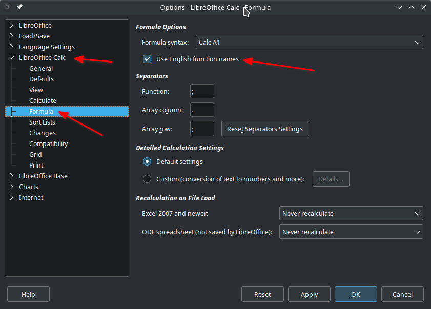
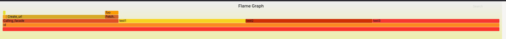

This is monorepo and php-profiler is split into two packages.
One package `php-profiler` is used to profile PHP code and does not include any external dependencies and support legacy PHP versions (7.2+).

The other package `php-profiler-cli` is used to analyse profiler data created by `php-profiler` package.
Because analyse process does not run on production env this library requires external dependencies and might require modern PHP version.

## Analysing saved profiler data

1. Fetch from server your file with serialized profiler data.
2. Clone this repository and go to directory `./packages/php-profiler-cli` and edit `composer.json` 
```json
{
    "name": "mmo/php-profiler-cli",
    # ...
    "repositories": [
        {
            "type": "path",
            "url": "../php-profiler"
        }
    ],
    "minimum-stability": "dev"
}
```
3. Install dependencies - `composer install`. You had to edit `composer.json` because at this moment these packages are not published.
4. Call`parse-profiler-data` to convert data to SQL queries for SQLite - `./parse-profiler-data /path/to/saved/profiler/data | sqlite3 profiler.db`
5. Open `profiler.db` in `sqlitebrowser` or other client e.g. PHPStorm.
6. Use SQL to select/filter stored data and export them to CSV/TSV for better analyse in for example LibreOffice Calc.  

### Useful SQL queries

SELECT MIN, MAX, AVG, total duration, number of probes:

```sql
SELECT MIN(duration) as min, MAX(duration) as max, AVG(duration) as avg, SUM(duration) as total_duration, count(1) as number_of_probes
FROM profiler 
WHERE depth = 0;
```

Filter rows which has a field `userID` with value `123` in metadata:
```sql
SELECT * FROM profiler WHERE json_extract(metadata, '$.userID') = 123;
```

Convert duration to INT

```sql
SELECT *, CAST(ROUND(duration, 0) as INT) duration_ms_int FROM profiler;
```

### Useful LibreOffice Calc functions

> ⚠️ **Warning**
> To use english function names you need mark a checkbox **Use English function names**.
>
> From "Tools" menu, select "Options".
> In showed dialog from left menu expand item "LibreOffice Calc" and then select "Formula" item.
> On the right check the checkbox "Use English function names"



95% PERCENTILE - `=PERCENTILE(A1:A10;0.95)`

MEDIAN - `=MEDIAN(A1:A10)`

## Flame Graph

This repo contains a fantastic external script to generate [flame graph](https://www.brendangregg.com/flamegraphs.html).

`./create-flame-graph /path/to/saved/profiler/data /output/direcotry/for/svg/files`


